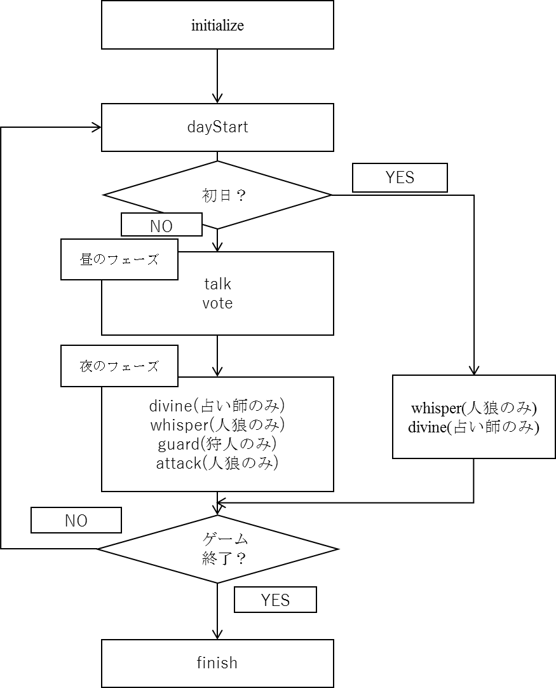

人狼知能における人狼のルール
========================

ゲーム開始時に、人狼では各プレイヤーに役職が割り当てられる。役職によってゲームの中での能力が変わり、これによってゲーム中に得られる情報や呼び出される関数が追加される。

この項ではルールで定められる役職の種類や勝利条件、ゲームの進行について解説する。

.. note::

    ここにおいてプレイヤーとは人工知能のエージェントのことを指す。

    人狼知能では15名が参加する人狼と5名が参加する人狼の二種類があるが、このドキュメントでは15名の人狼を想定して記述する。

役職の種類
-----------

人狼知能において、プレイヤーはまず以下の6つの役職を与えられ、それぞれの役職には種族と陣営がルールとして決められている。

.. csv-table::
    :header-rows: 1

    役職, 種族, 陣営
    VILLAGER(村人), HUMAN(人間), VILLAGER(村人側)
    WERWOLF(人狼), WEREWOLF(人狼), WEREWOLF(人狼側)
    SEER(占い師), HUMAN(人間), VILLAGER(村人側)
    POSSESSED(狂人), HUMAN(人間), WEREWOLF(人狼側)
    MEDIUM(霊媒師), HUMAN(人間), VILLAGER(村人側)
    BODYGUARD(狩人), HUMAN(人間), VILLAGER(村人側)

勝利条件
--------

ゲーム中には２つの陣営が存在し、それぞれ勝利条件は以下のようになる。

* 村人側の勝利条件

    人間の種族に属するプレイヤー以外がすべてゲーム中から排除された時

* 人狼側の勝利条件

    人狼の種族に属するプレイヤーの数が人間の種族に属するプレイヤーの数以上になった時

`AIWolfGame.java#L267 <https://github.com/aiwolf/AIWolfServer/blob/0.4.x/src/org/aiwolf/server/AIWolfGame.java#L267>`_

.. code-block:: java
    
    	public Team getWinner(){
    		int humanSide = 0;
    		int wolfSide = 0;
    		int otherSide = 0;
    		for(Agent agent:gameData.getAgentList()){
    			if(gameData.getStatus(agent) == Status.DEAD){
    				continue;
    			}
    			
    			
    			if(gameData.getRole(agent).getTeam() == Team.OTHERS){
    				otherSide++;
    			}
    			if(gameData.getRole(agent).getSpecies() == Species.HUMAN){
    				humanSide++;
    			}
    			else{:
    				wolfSide++;
    			}
    		}
    		if(wolfSide == 0){
    			if(otherSide > 0){
    				return Team.OTHERS;
    			}
    			return Team.VILLAGER;
    		}
    		else if(humanSide <= wolfSide){
    			if(otherSide > 0){
    				return Team.OTHERS;
    			}
    			return Team.WEREWOLF;
    		}
    		else{
    			return null;
    		}
    
        }

.. note:: 

    コード中にotherSideとあるが現在のルールでは、村人側と人狼側しか存在しない。

ゲームの進行
-----------

ゲームの進行は以下のようなフローチャートにより進む。ここで四角の中の英語表記で書かれているものが実際に呼び出される関数の名前である。

    ゲームの進行のフローチャート `第三回大会レギュレーション <http://aiwolf.org/3rd-aiwolf-contest>`_ より

